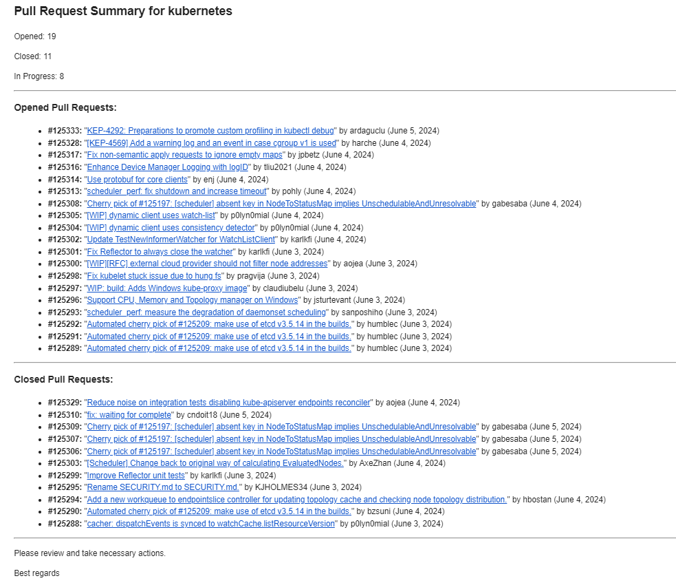

### Overview
This Go application utilizes the GitHub API to gather insights into the pull requests of a specified repository. It generates a summary report of opened, closed, and in-progress pull requests within the last week, which can be sent for project tracking purposes.

### Example Report
Here's an example of the email summary report format that the application generates:

