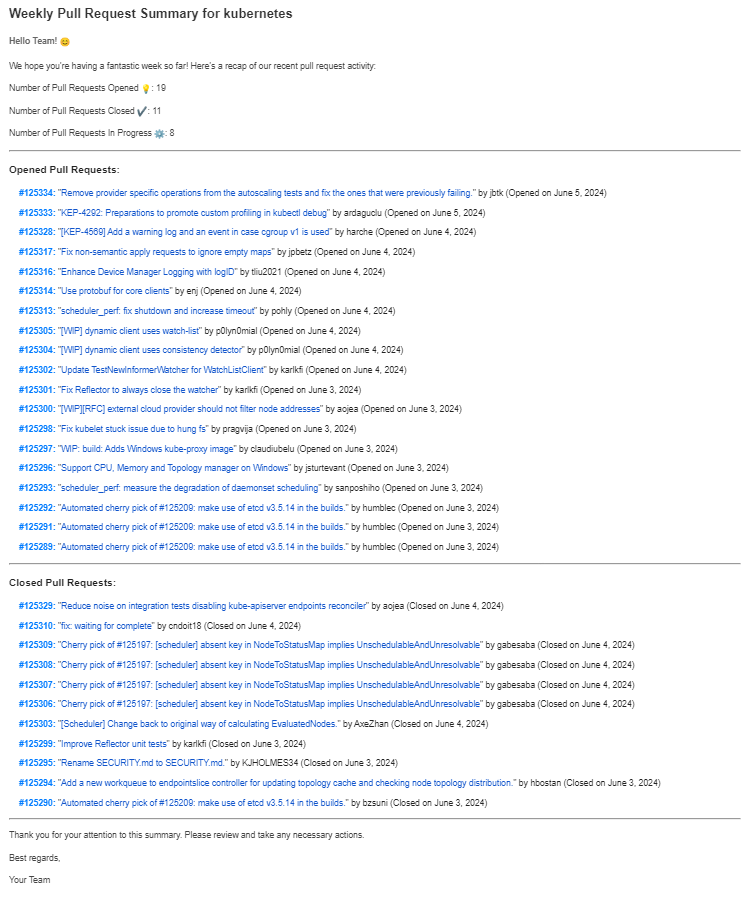
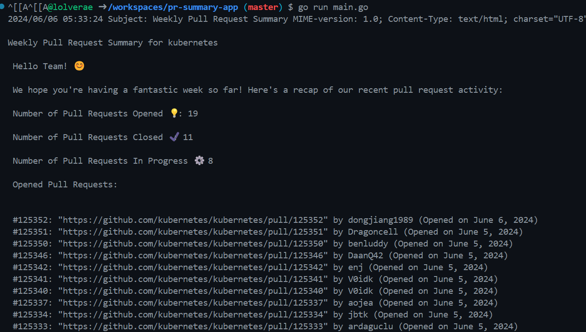

### Overview
This Go application utilizes the GitHub API to gather insights into the pull requests of a specified repository. It generates a summary report of opened, closed, and in-progress pull requests within the last week, which can be sent for project tracking purposes.

### Usage 
To use this project, follow these steps:

#### Set Up Local Development Environment

Before running the application, ensure you have set up your local development environment by running the provided setup script. This script will guide you through configuring the necessary environment variables stored in the `.env` file. Run the following command:

```bash
./setup_dev_environment.sh
```

Follow the prompts to enter the required variables. If you don't have the tokens or information required, the script will provide links to guides on obtaining them.

### Running with Docker

To run this application using Docker, follow these steps:


```bash
docker build -t pr-summary-app .
docker run -d -v /path/to/.env:/app/.env pr-summary-app
```

Replace `/path/to/.env` with the absolute path to your `.env` file.

The Docker container will now be running your Go application. Make sure to provide the required environment variables in the `.env` file to ensure proper functionality.

### Running as a Kubernetes CronJob

To run this application using Kubernetes as a CronJob, follow these steps:

#### Create Kubernetes Secret

First, create a Kubernetes Secret containing your `.env` file. Ensure your `.env` file is located in the same directory where you run the following command:

```bash
kubectl create secret generic pr-summary-dotfile --from-env-file=.env
```

#### Apply Kubernetes Manifest

Apply the Kubernetes manifest for the CronJob by running the following command:

```bash
kubectl apply -f ./kubernetes/prsummary_cron.yaml
```

#### Verify CronJob

To verify that the CronJob has been created successfully, you can run:

```bash
kubectl get cronjobs
```
You can monitor the execution of the CronJob's jobs by checking the corresponding Job resources. To see the list of Jobs created by the CronJob, run:

```bash
kubectl get jobs
```

The Kubernetes CronJob will now run your Go application container according to the specified schedule, using the secrets stored in the Kubernetes Secret.

### Example Report
Here's an example of the email summary report format that the application generates:


Here's an example of the summary report printed to the console that the application generates:



